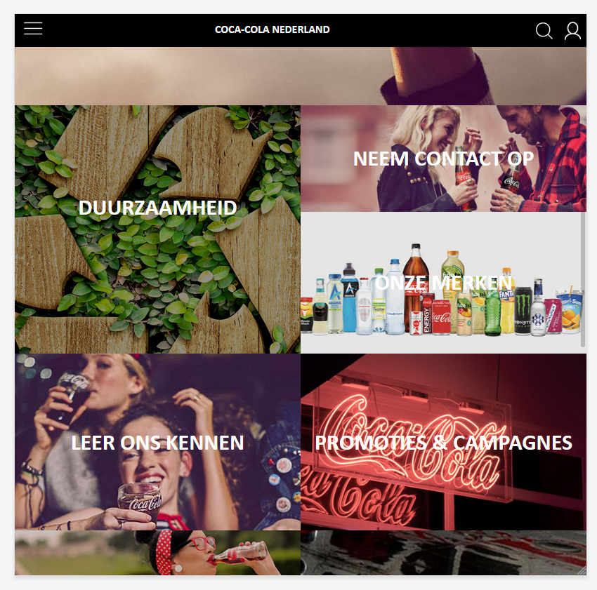

# Procesverslag
**Daniel**

## Bronnenlijst
1. www.cocacolanederland.nl (afbeeldingen)
2. CodePen oefeningen van Sanne
3. www.css-tricks.com
4. www.w3schools.com

## Eindgesprek (week 7/8)

Wat goed ging, en wat lastig was

Ik ben over het algemeen vrij tevreden over het eindresultaat, ondanks dat er enkele verbeterpunten zijn. Qua kennis ben ik er op voorruit gegaan, voorheen wist ik vrijwel niks van bijv. flexbox of grid, en merk nu dat er ik aardig bedreven in ben geworden.
Ik merkte gedurende het vak dat ik het opzich best leuk vond, maar alleen wanneer alles zo werkt als ik in gedachte heb. Wanneer dat niet het geval was merkte ik dat het vinden van motivatie om voortgang te maken moeilijk was. 

Ik kwam er tegen het einde achter dat dingetjes die ik nog even snel dacht te kunnen fixen, niet zo makkelijk te fixen waren. Ook had ik graag nog wat willen proberen een css slideshow te maken zoals op de originele website, maar alles wat ik online kon vinden was op een absoluut niet semantisch correcte manier uitgewerkt, dus besloot ik me op andere onderdelen te richten die ik nog moest maken. Ook het puntje toegankelijkheid (states, tab-index etc) is iets waar ik me nog graag in had willen verdiepen, maar waar ik niet aan toe ben gekomen.

**Screenshot(s):**

## Voortgang 3 (week 6)

### Stand van zaken

Wat goed ging:

Ik heb een groot stuk van de 2e pagina uitgewerkt, maar deze moet deels nog responsive worden, wel merk ik dat het gebruik van grid steeds makkelijker en logischer wordt.

Wat niet zo goed ging:

Ik ben er nog niet aan toegekomen om surface plane elementen te verwerken (zoals werkende menu-button, en andere uitklap-menu's), hier maak ik me echter nog geen zorgen om.

**Screenshot(s):**

## Voortgang 2 (week 5)

### Stand van zaken

Wat goed ging:

Het (nog gedeeltelijk) responsive maken van de pagina heeft toch wel meer moeite gekost dan ik had gehoopt. Maar is uiteindelijk best wel goed gelukt.

Wat niet zo goed ging:

Ik had moeite om mezelf aan te sporen om echt voortgang te maken voor het vak, uiteindelijk is het wel gelukt wat dingen toe te voegen, maar ik denk dat ik een beetje achterloop in vergelijking met de rest van het groepje. Ik heb een poging gedaan een css slideshow animatie te maken zoals op de originele website van cocacolanederland, maar dit was wel erg ingewikkeld. Uiteindelijk een soort van werkend gekregen met veel hulp van Google...

**Screenshot(s):**

### Agenda voor meeting

- Carrousel (css/html, of js?)
- Css image slider animation
- Text responsive maken
- :hover bug (Jelle)
- Slider van tekst en dingen toevoegen in winkelmandje

### Verslag van meeting

-na afloop snel uitkomsten vastleggen-

## Voortgang 1 (week 3)

### Stand van zaken

Wat goed ging: 

Mijn website begint aardig op het origineel te lijken, en ik begrijp inmiddels ook hoe CSS werkt zonder overal ID's en classes voor te gebruiken. 
Ook flexbox wordt me steeds duidelijker.

Wat niet zo goed ging:

Onderdelen zo positioneren als ik ze wil, blijft wel lastig. ik krijg het meestal wel voor elkaar, maar weet dat het niet de 'juiste' manier is, en denk dat ik het me er zelf moeilijker mee maak omdat ik er in de komende weken omheen zal moeten werken.

**Screenshot(s):**

### Agenda voor meeting

- Hoe kunnen we de website zo responsive mogelijk maken?
- Moeten we een hamburger menu werkend maken?
- Hoe style je 2 html pagina's met 1 css?
- Hoe maak je een caroussel?
- Wanneer pas je eigenlijk flexbox toe?

### Verslag van meeting

-na afloop snel uitkomsten vastleggen-

## Intake (week 1)

**startniveau:** Rood

**Je focus:** Surface plane

**Je opdracht:** www.cocacolanederland.nl

**Screenshot(s):**

**Breakdown-schets(en):**

